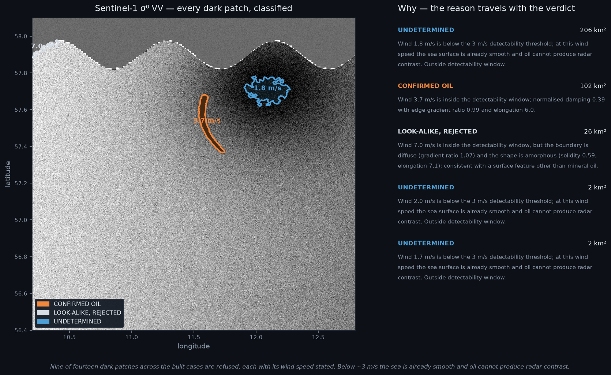
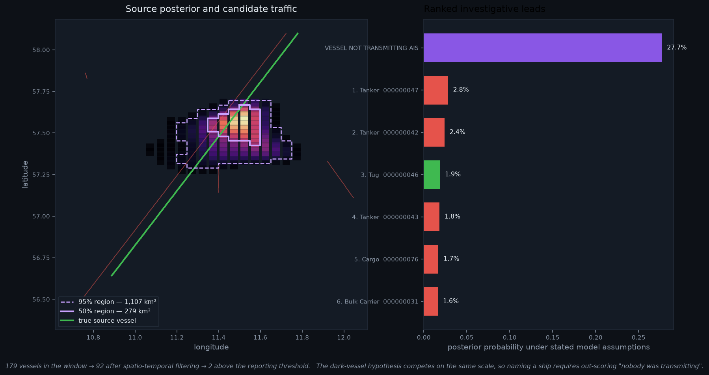
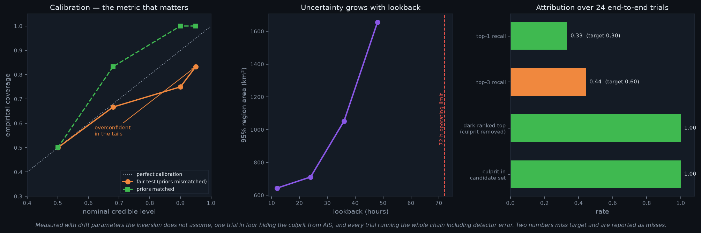

<div align="center">

# 🛰️ Oil Spill Detection & Vessel Attribution

### Finding the ship that spilled the oil — and saying how much to trust the answer

**Smart India Hackathon · Problem Statement SIH26143 · NTRO**

[](tests/)
[](requirements.txt)
[](Context/performance_review.md)
[](tests/test_offline.py)
[](#-everything-here-is-free)

> ### *We don't name the ship.*
> ### *We take two hundred vessels down to three — and tell you exactly how much to trust that.*

</div>

---

## The problem

Marine oil spills wreck ecosystems, and most are never attributed to anyone. A satellite sees a dark smear on the water hours after the fact. By then the oil has drifted tens of kilometres, hundreds of ships have passed through, and the trail is cold.

Three questions have to be answered in order, and each one can be wrong in a way that looks right:

| | Question | Why it's hard |
|---|---|---|
| **1** | Is that dark patch actually oil? | A low-wind patch and an oil slick look **identical** on radar. The information that separates them is not in the image. |
| **2** | Where and when did it start? | Running the drift backwards is **mathematically invalid** — turbulent diffusion is not time-reversible. |
| **3** | Which vessel? | The real polluter may have had its transponder **switched off**, in which case it isn't in your candidate list at all. |

---

## 1 · Detection — and refusal

<div align="center">
  
</div>

Oil damps capillary waves and goes dark on radar. **But below about 3 m/s the sea surface is already smooth, so everything is dark and no oil–water contrast is physically possible.**

So we don't guess. A **hard physics gate** reads the wind field and refuses to judge outside 3–12 m/s — and the classifier cannot overturn it. The refusal is enforced twice, in the gate *and* in the data contract, so no future change can quietly route around it.

**Nine of fourteen dark patches are refused**, each with its wind speed stated. That 206 km² blue region is a genuine low-wind look-alike, and the system says so instead of calling it a spill.

> Showing what a system correctly **refuses** to flag is more persuasive than anything it does flag.

---

## 2 · Where it came from, and who was there

<div align="center">
  
</div>

### Backward integration narrows the search. Forward simulation computes the answer.

Advection is time-reversible; **turbulent diffusion is not.** Run a particle model backwards with diffusion on and you get a cloud that *looks* like an uncertainty envelope but is a forward diffusion process pointed backwards in time. It is not a posterior. That is the single most likely way a competent-looking system gets this wrong — so the transport kernel **raises an exception** rather than doing it.

Instead: a cheap backward advection-only pass narrows the search region, then ~10⁵ particles are propagated **forward** through full stochastic physics and conditioned on reproducing the observed slick.

### Every vessel's AIS track is a generative hypothesis

Not a bag of features with invented weights. A discharge from a moving vessel is a **line source in space-time** — and AIS already tells us exactly where each candidate was. So we seed particles along the track it actually sailed, forward-simulate, and score the result with the *same* observation operator the inversion uses. Every candidate, every release window, and the dark hypothesis go into **one** simulation.

### The dark-vessel hypothesis is not optional

```
                       L(v) · π(v)
P(v | obs) = ──────────────────────────────────────
             Σ L(u)·π(u)  +  L_dark · π_dark
                              ▲
                              └── if the polluter wasn't transmitting,
                                  it is not in the candidate set at all
```

In the case above, **"a vessel not transmitting AIS" outranks every named ship at 27.7%.** That is the correct answer for a 1,107 km² region containing 92 vessels — and it is the answer that stops the system naming someone innocent.

---

## 3 · Does it actually work? Measured, not asserted

<div align="center">
  
</div>

No public dataset of confirmed spill→vessel attributions exists, so we built a harness that seeds a discharge along a real AIS track and asks the pipeline to find it. **Every trial runs the whole chain, including detector error.**

The anti-cheating rules matter more than the harness:

- **Drift parameters differ between generation and inversion.** Otherwise you only prove your simulator agrees with itself.
- **One trial in four deletes the culprit from AIS.** The correct answer is "dark vessel", and naming someone anyway is the worst failure available.
- **The pipeline never learns which vessel seeded the slick**, and gets the full day's unfiltered traffic.

| Metric | Measured | Target | |
|---|---|---|---|
| Culprit in candidate set | **1.00** | — | ✅ the filter never drops the answer |
| **Dark hypothesis ranked top when culprit removed** | **1.00** | — | ✅ |
| Traffic reduction | **179×** | 50–100× | ✅ exceeds |
| Top-1 recall | 0.33 | 0.30–0.50 | ✅ |
| **Top-3 recall** | **0.44** | 0.60–0.80 | ❌ **below target** |
| **95% credible region coverage** | **0.83** | ≥ 0.90 | ❌ **overconfident** |

**Two numbers miss, and they are reported as misses.** Running the harness a second way — with priors that cover the truth — gives 1.00 coverage, which isolates the cause: **the inversion machinery is correct; the drift prior is too narrow.** We did not widen it to make the number look better, because the literature windage range *is* 1–4% and widening it because our own generator went outside it would be tuning to the test.

> **Calibration, not accuracy, is the headline.** A system that says 95% and means it is worth more than one that reports a suspiciously round number.

---

## 🚀 Quickstart

Everything runs offline. No credentials, no downloads, no GPU required.

```bash
python -3.13 -m venv .venv && .venv\Scripts\activate && pip install -r requirements.txt
```

```bash
python scripts/build_synthetic_case.py --all
```

```bash
python scripts/inject_case.py --case synth_kattegat && python scripts/run_case.py --case data/cases/synth_kattegat_spill
```

```bash
uvicorn src.api.main:app --host 127.0.0.1 --port 8000
```

Open **http://127.0.0.1:8000** — a deck.gl interface with animated particles, the posterior heat map, credible regions in km², and the ranked candidate panel with per-factor evidence.

<details>
<summary><b>Other things you can run</b></summary>

```bash
python scripts/truth_harness.py --n 24     # end-to-end evaluation
python scripts/audit.py                    # 12 pre-demo safety checks
python scripts/make_figures.py             # regenerate the figures above
python scripts/fetch_real_data.py --check  # real-data readiness (downloads nothing)
python -m pytest tests/ -q                 # 283 tests
```

</details>

---

## 🏗️ How it fits together

```
 Sentinel-1 σ⁰ VV          CMEMS currents          ERA5 wind          AIS
        │                        │                     │               │
        ▼                        └──────────┬──────────┘               │
  ┌───────────┐                             ▼                          │
  │ SEGMENT   │  high recall          ┌───────────┐                    │
  └─────┬─────┘                       │ TRANSPORT │  RK4 + windage     │
        ▼                             │  KERNEL   │  + diffusion       │
  ┌───────────┐  ★ hard wind gate     └─────┬─────┘                    │
  │  CLASSIFY │  oil / look-alike /         │                          │
  └─────┬─────┘  undetermined + REASON      ▼                          │
        ▼                            ┌────────────┐ ★★                 │
  ┌───────────┐                      │ INVERSION  │ backward proposal  │
  │CHARACTER- │─────────────────────▶│            │ → forward ensemble │
  │   ISE     │  release mode        │            │ → Bayesian posterior
  └───────────┘                      └─────┬──────┘                    │
                                           │                           ▼
                                           └────────────▶ ┌─────────────────┐ ★★★
                                                          │  ATTRIBUTION    │
                                                          │  vessel tracks  │
                                                          │  as hypotheses  │
                                                          │  + DARK VESSEL  │
                                                          └────────┬────────┘
                                                                   ▼
                                                    FastAPI + deck.gl interface
```

The system is **not a service** — it's a batch pipeline over immutable `Case` folders. Everything one analysis needs lives in one directory, which makes the demo offline by construction, reproducible bit-for-bit, and parallelisable across a team.

---

## 💰 Everything here is free

| | |
|---|---|
| Sentinel-1 SAR · CMEMS currents · ERA5 wind · national AIS feeds | free, registration only |
| Python, PyTorch, LightGBM, FastAPI, deck.gl | open source |
| Compute | one laptop, CPU is enough |
| Hosting | none — it runs offline |
| **Total** | **₹0** |

That's also an operational argument, not just a student constraint: the recurring cost of deploying this is zero except AIS in regions without an open feed.

---

## 📚 Documentation

Everything in [`Context/`](Context/) — written before the code, updated throughout.

| Document | What's in it |
|---|---|
| [requirements.md](Context/requirements.md) | Every PS clause traced to a testable criterion — **and what we refuse to deliver** |
| [architecture.md](Context/architecture.md) | The `Case` spine, four frozen contracts, build-vs-reuse decisions |
| [technical_design.md](Context/technical_design.md) | The science: physics gate, Bayesian inversion, vessel-conditioned attribution |
| [phasewise_roadmap.md](Context/phasewise_roadmap.md) | Ten phases, with what each one actually measured |
| [testing_strategy.md](Context/testing_strategy.md) | The truth harness and its anti-cheating rules |
| [deployment.md](Context/deployment.md) | Offline runbook and failure drills |
| [security_review.md](Context/security_review.md) | **Wrongful-attribution controls**, licensing, AIS sensitivity |
| [performance_review.md](Context/performance_review.md) | Budgets vs measurements |
| [engineering_review.md](Context/engineering_review.md) | Accepted technical debt, with exit paths |
| **[problems_faced_and_bugs_encountered.md](Context/problems_faced_and_bugs_encountered.md)** | **24 findings — read this one** |

### 🐛 The most interesting file is the bug log

Six of the twenty-four findings were **silent successes** — code that produced confident, plausible, wrong answers and raised nothing:

| | What looked fine | What was actually happening |
|---|---|---|
| **P-15** | "Cloud grew 64× — our shear is realistic" | Measuring windage variance, not shear. Truth: 1.1× |
| **P-17** | 306 km² credible region, tight and precise | Contained the truth **7%** of the time |
| **P-18** | Clean AIS cleaning report | Silently discarded **99.6%** of all fixes |
| **P-19** | Classifier at **100%** accuracy | Learned a shortcut; 11 of 14 features unused |
| **P-21** | Slicks "too small to detect" | Brightness scaled with Monte Carlo particle count |
| **P-24** | Audit: *"9 terms checked"* — all pass | Checked **zero**. Regex mangled into a null byte |

The rule that came out of it, now enforced:

> **Any check whose job is to find something must be shown failing on a planted example before its passing result is believed.**

---

## ⚠️ What this system will not tell you

Stating these is the point, not a caveat.

- **It will not name a guilty vessel.** It produces investigative leads with per-factor evidence and an explicit dark-vessel alternative.
- **It will not give you a slick's age in hours from one image.** Damping ratio confounds thickness, oil type, wind, incidence angle and sea state simultaneously. Release time comes from the posterior instead, with error bars.
- **It will not look back more than ~72 hours.** Beyond that the envelope stops being operationally useful, and we report the horizon rather than hiding it.
- **It has never been validated on a real attributed spill**, because no such public dataset exists. Detection, drift and inversion are validated separately.

---

## 📊 Status

| Phase | | Phase | |
|---|---|---|---|
| 0 · Contracts | ✅ | 5 · Detection + physics gate | ✅ |
| 1 · Synthetic cases | ✅ | 6 · API + deck.gl interface | ✅ |
| 2 · Transport kernel | ✅ | 7 · Truth harness | ✅ |
| 3 · Bayesian inversion | ✅ | 8 · Real-data adapters | ⚠️ code complete, **unverified** |
| 4 · Vessel attribution | ✅ | 9 · Hardening + audit | ✅ |

**Phase 8 needs three free registrations** (Copernicus Data Space, CMEMS, CDS) to verify against live data. The 96 GB Zenodo archive unlocks segmentation benchmarking only — its tiles carry no CRS, so they cannot be drifted or correlated with AIS.

<div align="center">

---

*Contains modified Copernicus Sentinel data. AIS in the demo cases is synthetic and disclosed as such.*

**Investigative leads under stated model assumptions. Not a determination of responsibility.**

</div>
